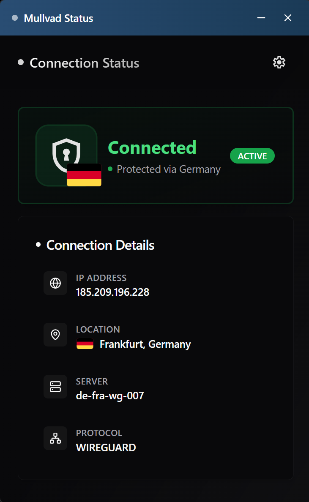

# Mullvad Connection Status

[](LICENSE)
[](https://github.com/Cyneric/mullvad-connection-status)
[](https://tauri.app/)
[](https://www.typescriptlang.org/)
[](https://react.dev/)
[](https://github.com/Cyneric/mullvad-connection-status/releases)

A lightweight Windows system tray application for monitoring Mullvad VPN connection status in real-time. Built with Tauri, React, TypeScript, and Tailwind CSS.

## Quick Start

### For End Users (No Development Setup Required)

**Download the latest installer:**
1. Go to [Releases](https://github.com/Cyneric/mullvad-connection-status/releases)
2. Download `Mullvad-Connection-Status_x.x.x_x64-setup.exe`
3. Run the installer
4. The app will appear in your system tray automatically

No Node.js or Rust required for the pre-built installer!

### For Developers

Continue reading for full development setup instructions below.

## Overview

This application provides a visual indicator for your Mullvad VPN connection status when running the VPN on a gateway device. It sits quietly in your system tray, changing colors based on your connection state, and displays detailed connection information when needed.

<div align="center">
  
  <p><em>Mullvad connection status application - screenshot</em></p>
</div>

## Features

- **System Tray Integration** - Unobtrusive tray icon that changes color based on VPN status (green for connected, red for disconnected)
- **Custom Title Bar** - Modern, draggable window with minimize and close controls that blend with the application design
- **Dark Mode Support** - Toggle between light and dark themes with persistent preference storage
- **Real-time Monitoring** - Checks VPN connection status every 15 seconds
- **Connection Details** - View your current IP address, server location, hostname, and protocol type
- **Country Flags** - Visual country flag indicators showing which VPN server location you're connected to
- **Auto-Start Settings** - Built-in UI toggle to enable/disable automatic startup with Windows
- **Desktop Notifications** - Optional alerts when your VPN connection state changes
- **Taskbar Integration** - Window appears in the taskbar when open for easy access and management


## Technology Stack

- **Frontend**: React 18, TypeScript, Tailwind CSS, shadcn/ui components
- **Icons**: Lucide React, country-flag-icons, Material Symbols
- **Backend**: Rust (Tauri v2 framework)
- **Build Tools**: Vite, npm, Sharp (for icon generation)
- **APIs**: Mullvad public API (am.i.mullvad.net)

## Prerequisites

Before you begin, ensure you have the following installed:

### 1. Node.js (version 18 or later)

**Download and Install:**
- Visit [nodejs.org](https://nodejs.org/)
- Download the LTS version for Windows
- Run the installer and follow the prompts
- Verify installation:
  ```bash
  node --version
  npm --version
  ```

### 2. Rust (latest stable version)

**Install using rustup:**
- Visit [rustup.rs](https://rustup.rs/)
- Download and run `rustup-init.exe`
- Follow the installation prompts (use default options)
- **Important:** Restart your terminal after installation
- Verify installation:
  ```bash
  rustc --version
  cargo --version
  ```

**Alternative using winget:**
```bash
winget install Rustlang.Rustup
```

### 3. Visual Studio Build Tools (Windows - Required)

**This is critical for Rust compilation on Windows.**

**Option A: Visual Studio Build Tools (Recommended)**
1. Download from [Visual Studio Downloads](https://visualstudio.microsoft.com/downloads/)
2. Scroll to "Tools for Visual Studio"
3. Download **Build Tools for Visual Studio 2022**
4. Run the installer
5. Select **"Desktop development with C++"** workload
6. Ensure these components are checked:
   - MSVC v143 - VS 2022 C++ x64/x86 build tools (Latest)
   - Windows 11 SDK (or Windows 10 SDK)
   - C++ CMake tools for Windows
7. Click Install
8. **Restart your terminal** after installation

**Option B: Using winget**
```bash
winget install Microsoft.VisualStudio.2022.BuildTools --override "--wait --add Microsoft.VisualStudio.Workload.VCTools --includeRecommended"
```

**Verify installation:**
```bash
where link.exe
```
This should show a path like `C:\Program Files (x86)\Microsoft Visual Studio\2022\BuildTools\...`

### 4. WebView2 Runtime

**Usually pre-installed on Windows 11**, but if needed:
- Download from [Microsoft Edge WebView2](https://developer.microsoft.com/microsoft-edge/webview2/)
- Install the Evergreen Standalone Installer

## Installation

1. **Clone or download this repository**
   ```bash
   git clone <repository-url>
   cd mullvad-connection-status
   ```

2. **Install Node.js dependencies**
   ```bash
   npm install
   ```

3. **Verify prerequisites** (optional but recommended)
   ```bash
   node --version   # Should show v18.x or higher
   cargo --version  # Should show cargo 1.x.x
   where link.exe   # Should show Visual Studio path
   ```

That's it! You're ready to go.

## Development

To run the application in development mode with hot-reloading:

```bash
npm run tauri dev
```

This will start the Vite dev server and launch the Tauri application window.

## Building for Production

To create a production build:

```bash
npm run tauri build
```

The compiled executable will be located in:
```
src-tauri/target/release/mullvad-connection-status.exe
```

An installer will also be generated in:
```
src-tauri/target/release/bundle/
```

## Configuration

### Changing the Polling Interval

By default, the application checks VPN status every 15 seconds. To modify this:

1. Open `src-tauri/src/main.rs`
2. Find line 84 (approximately)
3. Change the duration value:
   ```rust
   let mut poll_interval = interval(Duration::from_secs(15)); // Change 15 to your preferred interval
   ```

## Windows Auto-Start Setup

The application includes a built-in auto-start toggle in the Settings page:

### Using the Settings UI (Recommended)

1. Launch the application
2. Click the tray icon to open the status window
3. Click the Settings (gear) icon in the top navigation
4. Toggle the "Start at Windows boot" switch
5. The application will now start automatically when Windows boots

The auto-start feature uses the Windows Registry method (`HKEY_CURRENT_USER\Software\Microsoft\Windows\CurrentVersion\Run`) and can be easily toggled on or off from the Settings page.

### Manual Methods (Alternative)

If you prefer manual setup:

**Startup Folder Method:**
1. Build the application using `npm run tauri build`
2. Navigate to: `src-tauri/target/release/`
3. Right-click on `mullvad-connection-status.exe` → "Create shortcut"
4. Press `Win + R`, type `shell:startup`, press Enter
5. Move the shortcut into the Startup folder

**Registry Method:**
1. Press `Win + R`, type `regedit`, press Enter
2. Navigate to: `HKEY_CURRENT_USER\Software\Microsoft\Windows\CurrentVersion\Run`
3. Create String Value:
   - Name: `MullvadConnectionStatus`
   - Value: `"C:\full\path\to\mullvad-connection-status.exe"`

## How It Works

The application queries Mullvad's public API endpoint (`https://am.i.mullvad.net/json`) to determine if your internet traffic is routing through a Mullvad VPN server. The API returns information including:

- Whether you're connected to a Mullvad server
- Your current public IP address
- The geographic location of the VPN server
- The server hostname
- The connection protocol (WireGuard or OpenVPN)

This information is displayed in a clean, minimal interface accessible by clicking the tray icon.

## Usage

### Basic Operation

1. Launch the application
2. The tray icon appears in your system tray (bottom-right of taskbar)
3. The icon color indicates your status:
   - Green = Connected to Mullvad VPN
   - Red = Not connected
4. Left-click the tray icon to show/hide the status window
5. Right-click the tray icon for the menu (Show/Quit options)

### Status Window

When you click the tray icon, a window appears showing:
- Connection status with a visual indicator and country flag
- Your current IP address
- Server location (city and country) with flag icon
- Server hostname
- Connection protocol type

The window features:
- **Custom draggable title bar** - Click and hold the left side to move the window
- **Minimize button** - Minimize to taskbar (window remains in taskbar for easy restoration)
- **Close button** - Hides the window to system tray (application continues running)
- **Settings page** - Configure auto-start and other preferences

Click the close button or the tray icon again to hide the window. The application continues running in the background.

## Troubleshooting

### Error: `link.exe` not found

**Problem:** Rust compilation fails with "linker `link.exe` not found"

**Solution:**
1. Install Visual Studio Build Tools (see Prerequisites section above)
2. Make sure you selected the "Desktop development with C++" workload
3. **Restart your terminal** after installation
4. Verify with `where link.exe` - should show Visual Studio path
5. If still not working, try running from "Developer Command Prompt for VS 2022"

### Error: `cargo` command not found

**Problem:** Rust is not installed or not in PATH

**Solution:**
1. Install Rust from [rustup.rs](https://rustup.rs/)
2. **Restart your terminal completely** (close and reopen)
3. Verify with `cargo --version`
4. If still not working, manually add to PATH: `%USERPROFILE%\.cargo\bin`

### Build Fails or Compilation Errors

**Try these steps in order:**

1. **Update Rust:**
   ```bash
   rustup update
   ```

2. **Clean the build cache:**
   ```bash
   cd src-tauri
   cargo clean
   cd ..
   ```

3. **Remove node_modules and reinstall:**
   ```bash
   rm -rf node_modules package-lock.json
   npm install
   ```

4. **Try building again:**
   ```bash
   npm run tauri build
   ```

### WebView2 Not Found

**Problem:** Application won't launch, missing WebView2

**Solution:**
Download and install WebView2 Runtime from [Microsoft](https://developer.microsoft.com/microsoft-edge/webview2/).

### Application Won't Start in Dev Mode

**Problem:** Port 1420 already in use

**Solution:**
1. Check if another instance is running (close it)
2. Or change the port in `vite.config.ts`:
   ```typescript
   server: {
     port: 1421, // Change to different port
   }
   ```

### Icons Don't Appear in System Tray

**Problem:** No tray icon visible

**Solution:**
1. Check that icon files exist in `src-tauri/icons/` (they should be in the repo)
2. Try rebuilding: `npm run tauri build`
3. On Windows 11, check system tray settings (some icons may be hidden)

### VPN Status Not Updating

**Problem:** Shows "Disconnected" even when VPN is active

**Solution:**
1. Verify internet connection is working
2. Test the API manually: visit `https://am.i.mullvad.net/json` in browser
3. Check firewall isn't blocking the application
4. Verify you're actually routing through Mullvad (check on gateway)

### First Build Takes Very Long

**This is normal.** The first Rust build compiles all dependencies and can take 5-10 minutes. Subsequent builds will be much faster (under 1 minute for small changes).

## Project Structure

```
mullvad-connection-status/
├── src/                          # React frontend source
│   ├── components/               # React components
│   ├── lib/                      # Utility functions
│   ├── App.tsx                   # Main application component
│   └── main.tsx                  # Entry point
├── src-tauri/                    # Rust backend source
│   ├── src/
│   │   ├── main.rs               # Application entry and tray setup
│   │   └── vpn_checker.rs        # VPN status API client
│   ├── icons/                    # Application icons
│   └── tauri.conf.json           # Tauri configuration
├── scripts/                      # Build and utility scripts
└── package.json                  # Node.js dependencies
```

## Contributing

Contributions are welcome. Please ensure all code follows the existing style and includes appropriate documentation.

## License

MIT License - Copyright (c) 2026 Christian Blank

See LICENSE file for full details.

## Acknowledgments

- [Mullvad VPN](https://mullvad.net/) for providing the public API
- [Tauri](https://tauri.app/) for the excellent application framework
- [shadcn/ui](https://ui.shadcn.com/) for the beautiful UI components
